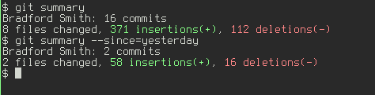

# git-summary

A script to provide `git summary`, a command to print a summary of git author
contributions.

You can provide an author as an argument to see a summary of only that author's
contributions or leave it off for a summary from all authors.

**Note:** git-summary is not a part of (or affiliated with) git.

## Installing

Use `./configure` to set install prefix if desired.

Then `make install`.

There is also an [AUR](https://aur.archlinux.org/packages/git-summary/) package
that I maintain.

## Options

You can provide a select set of options which are used directly by `git log`.

- `--after=<date>`/`--since=<date>`
    - Only show a summary of commits more recent than the given date.

- `--until=<date>`/`--before=<date>`
    - Only show a summary of commits older than the given date.

See the included manpage for more (`man git-summary`).

### Colors

If you have git configured to print in color (using `color.ui`) than git-summary
will also. It will print author additions using the value of `color.diff.new`
(defaulting to green) and it will print author deletions using the value of
`color.diff.old` (defaulting to red).

See `man git-config` for more about configuring colors in git.
